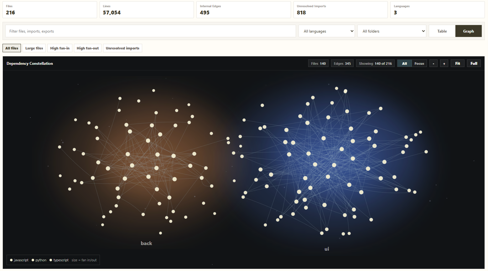
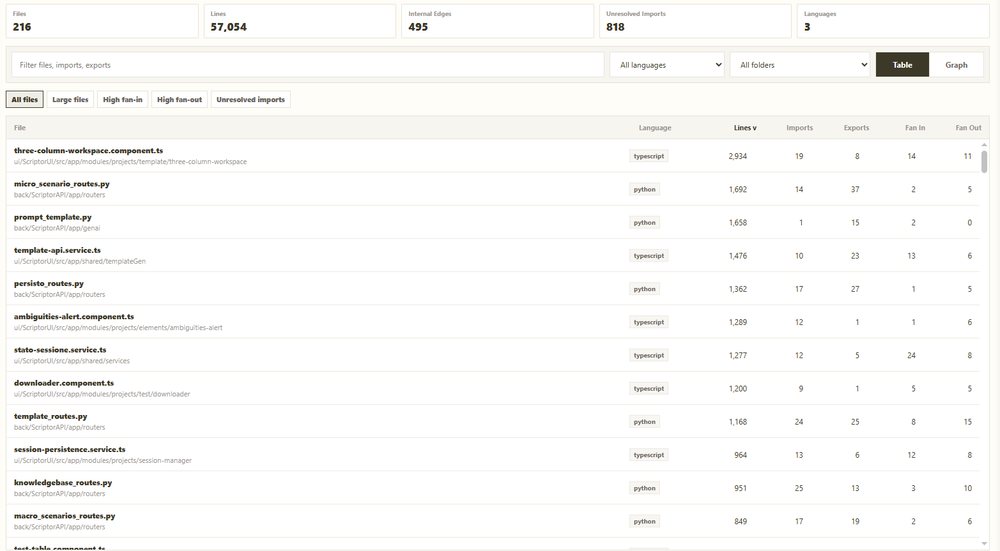

# Atlante

**Deterministic repo triage for AI-assisted developers.**

Atlante scans your workspace and shows you, locally and without any LLM, which files in your repo deserve attention right now — the ones that grew too large, became import hubs, or drifted into cycles while you were shipping fast.

<p align="center">
  
</p>

## Why

AI-assisted coding amplifies volume. Structural judgment doesn't scale at the same speed:

- files grow past 3,000 lines before anyone notices
- dead code accumulates — the agent writes helpers that will never be called
- duplicate imports and cycles appear by accident, not by choice
- silent fan-in turns innocent modules into single points of failure

Linters look at one line. Type checkers look at types. Neither tells you *which file to refactor next*. Atlante does.

Three principles, in order:

1. **Deterministic.** Same input → same output. Always.
2. **Local.** Nothing leaves your machine. No accounts, no uploads, no telemetry.
3. **Prescriptive.** Not "here's a graph to interpret" — "these are the files that matter, sorted".

## What you get today

<p align="center">
  
</p>

- **Source inventory table** — every file with LOC, imports, exports, fan-in, fan-out. Sortable, searchable, filterable.
- **Quick filters** — *Large files*, *High fan-in*, *High fan-out*, *Unresolved imports*. One click, see what stands out.
- **File details drawer** — symbols, imports (resolved vs external vs unresolved), dependents, open-file action.
- **Dependency Constellation** — interactive graph of internal dependencies, clustered by top-level folder, with a focus mode to see only what connects to the selected file.
- **Project library** — analyze multiple projects, switch between them from the sidebar.
- **Persistent analysis** — results are serialized under `.atlante/` in your workspace: stable JSON, diff-friendly, versionable.

Supported languages: JavaScript, TypeScript, Python via Tree-sitter AST; Java, C#, Go, Rust, Kotlin, Swift, Ruby, PHP via a generic/fallback parser.

## What's next

The next layer is **diagnostics** — deterministic rules that turn the inventory into actionable refactor flags (`god-file`, `giant-function`, `hub-file`, `file-cycle`, `dead-export`, and more). The full plan lives in [docs/todo/diagnostics.md](docs/todo/diagnostics.md).

See [docs/vision.md](docs/vision.md) for the longer framing.

## Install

Atlante is not yet on the VS Code Marketplace. To try it locally:

```bash
git clone https://github.com/Alex31y/Atlante.git
cd Atlante
npm install
npm run build
npm run package
```

Then in VS Code: **Extensions → ⋯ → Install from VSIX…** and pick the generated `atlante-*.vsix`.

## Use

1. Open any workspace.
2. Command palette → **Atlante** (opens the panel).
3. Click **Analyze Workspace** in the sidebar.
4. Explore: sort the table, flip to the graph, click rows for details.

## Commands

| Command | What it does |
|---|---|
| `archlens.showDiagram` | Open the Atlante panel |
| `archlens.analyzeWorkspace` | Run a full scan |
| `archlens.refreshDiagram` | Re-analyze the workspace |
| `archlens.switchProject` | Switch the active analyzed project |
| `archlens.removeProject` | Remove a project from the library |

Per-feature docs: [docs/reference/](docs/reference/README.md).

## Settings

| Setting | Default | Purpose |
|---|---|---|
| `archlens.excludePatterns` | 40+ globs | Folders/files skipped during analysis |
| `archlens.maxFilesForFullAnalysis` | 500 | Warn threshold before analyzing very large workspaces |

## Development

```bash
npm install
npm run build        # full build
npm run watch        # rebuild on change
npm run lint         # tsc --noEmit
npm test             # vitest
npm run package      # produce .vsix
```

Repo layout:

```
src/
├── extension/   # VS Code host (commands, providers, services, watchers)
├── webview/     # React UI (inventory + graph)
├── workers/     # Worker-thread Tree-sitter parsing
└── shared/      # Types, constants, import resolver
```

## Non-goals

- No chat, no LLM, no API keys, no embeddings.
- No cloud analysis, no telemetry on your code.
- Not a linter, not a type checker, not a runtime profiler.

## License

MIT — see [LICENSE](LICENSE).
